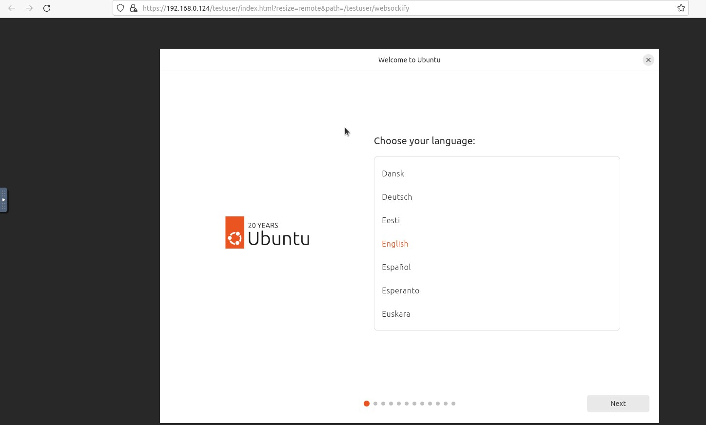

# VMConnect
Software tool for managing virtual machines and organizing secure connections to them via noVNC
    SETTINGS:
    Create a database in the PostgreSQL DBMS according to the config.py file in the backend section.
    Example:
    SQLALCHEMY_DATABASE_URI = 'postgresql://<login>:<password>!@localhost:5433/attackbase' 

    Make the deploy.sh and start-stop.sh scripts executable –
    chmod +x (script name) 

    Run the deploy.sh script – it will check and install all dependencies required to launch the software. 

    Run the start-stop.sh script – follow its instructions to start or stop the software. 
     

NOTE!  All scripts must be run by a user with root privileges.   

Also, you need to generate an SSL key and certificate for Nginx. Below is a basic configuration – nginx.conf: 
user www-data;

events {
    # Event settings (leave empty if not required)
}

http {
    server {
        listen 443 ssl http2;
        server_name localhost;
        client_max_body_size 10G;

        # Paths to SSL certificates
        ssl_certificate /etc/nginx/ssl/fullchain.pem;
        ssl_certificate_key /etc/nginx/ssl/private_key.pem;
    }
}

###########################WORK EXAMPLES#############################################
1. Login page

2. Admin interface

3. User interface

4. Enter password noVNC

5. Work with VM over noVNC

